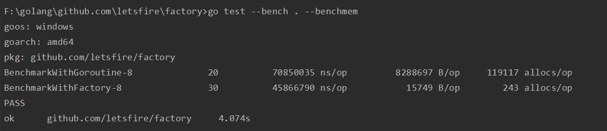

Go语言的协程池 , 节省内存 , 减少GC压力

## 安装
`go get github.com/letsfire/factory`

## 用法
```go
// 新建协程池 , 最大允许协程数20000和初始化数量8
// 协程工人繁忙不够用的情况下 , 内部实现自动扩容
// 扩容不会超过您指定的最大允许协程数量
var master = factory.NewMaster(20000, 8)

// 新建第一条工作流水线
var line1 = master.AddLine("demo.line.1", func(args interface{}) {

	// TODO 处理您的业务逻辑
	// fmt.Println(args...)

})

// 新建第二条工作流水线
var line2 = master.AddLine("demo.line.2", func(args interface{}) {

	// TODO 处理您的业务逻辑
	// fmt.Println(args...)

})

// 根据业务场景将参数提交
for i := 0; i < 100000; i++ {
	line1.Submit(i)
}

for j := 0; j < 100000; j++ {
	line2.Submit(j)
}

// 协程池数量可动态调整
master.Running()            // 正在运行的协程工人数量
master.AdjustSize(100)      // 指定数量进行扩容或缩容
master.Shutdown()           // 等于 master.AdjustSize(0)
```

## Benchmark
[测试代码](./bench_test.go) , 增加 `runTimes` 参数原始的 `Goroutine` 会出现崩溃 , 使用 `Factory` 的表现稳定



